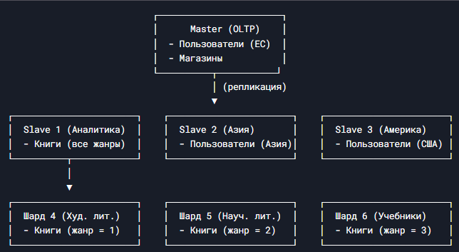

# Домашнее задание к занятию "`Репликация и масштабирование. Часть 2`" - `Барышков Михаил`

## Задание 1

Опишите основные преимущества использования масштабирования методами:

- активный master-сервер и пассивный репликационный slave-сервер;
- master-сервер и несколько slave-серверов;

*Дайте ответ в свободной форме.*

---

## Решение 1

1. Активный master-сервер и пассивный репликационный slave-сервер

- Отказоустойчивость: Если master-сервер выходит из строя, slave можно быстро перевести в режим master (с помощью инструментов вроде Patroni или ручного failover), минимизируя downtime.
- Чтение без нагрузки на master: Запросы на чтение можно направлять на slave, снижая нагрузку на master, что особенно полезно для аналитических запросов и отчетов.
- Резервное копирование без нагрузки: Бэкапы можно делать с slave, не нагружая master.
- Простота развертывания: Настроить одну реплику проще, чем кластер из нескольких серверов.

2. Master-сервер и несколько slave-серверов

- Горизонтальное масштабирование чтения: Нагрузку на чтение можно распределить между несколькими slave-серверами, что особенно важно для высоконагруженных систем.
- Геораспределение: Slave-серверы можно размещать в разных дата-центрах для уменьшения задержки у клиентов в разных регионах.

- Разделение нагрузки по назначению:

  - Один slave может использоваться для отчетов,

  - Другой — для резервного копирования,

  - Третий — для тестирования (например, проверки обновлений перед деплоем на master).

- Повышенная отказоустойчивость: При выходе из строя одного slave остальные продолжат обслуживать запросы.

### Вывод

Оба подхода улучшают отказоустойчивость и производительность, но один slave подходит для небольших систем, а несколько slave — для высоконагруженных проектов с большим объемом чтения

---

## Задание 2

Разработайте план для выполнения горизонтального и вертикального шаринга базы данных. База данных состоит из трёх таблиц:

- пользователи,
- книги,
- магазины (столбцы произвольно).

Опишите принципы построения системы и их разграничение или разбивку между базами данных.

*Пришлите блоксхему, где и что будет располагаться. Опишите, в каких режимах будут работать сервера.*

---

## Решение 2

### План горизонтального и вертикального шардинга базы данных

### 1. Вертикальный шардинг

Принцип: Разделение таблиц по разным серверам в зависимости от их назначения и нагрузки.

Схема:

- Сервер 1 (Master, OLTP-нагрузка):
  - Таблица пользователи (частые записи, обновления профилей, авторизация).
  - Таблица магазины (информация о магазинах, обновляется редко).
- Сервер 2 (Slave, аналитика/отчеты):
  - Таблица книги (большой объем данных, частые запросы на чтение).

### Обоснование:

- Пользователи и магазины требуют высокой доступности и частых записей → OLTP-сервер.
- Книги чаще читаются (каталог, поиск) → вынесены на отдельный аналитический сервер.

### 2. Горизонтальный шардинг

Принцип: Разделение одной таблицы по строкам между разными серверами (партиционирование).

### Схема:

- Таблица пользователи шардируется по регионам:
  - Сервер 1 (Европа): user_id % 3 = 0
  - Сервер 2 (Азия): user_id % 3 = 1
  - Сервер 3 (Америка): user_id % 3 = 2
- Таблица книги шардируется по жанрам:
  - Сервер 4 (Художественная литература)
  - Сервер 5 (Научная/техническая литература)
  - Сервер 6 (Учебники и справочники)
- Таблица магазины остается на Master-сервере, так как она небольшая и редко обновляется.



### Обоснование:

- Пользователи распределяются географически для уменьшения задержки.
- Книги разделяются по жанрам для оптимизации запросов (поиск в одном жанре быстрее).

### Режимы работы серверов

```text
Сервер  	Режим работы    	    Назначение
---------------------------------------------------------------------------
Master  	Read/Write (OLTP)	    Основные записи (пользователи,магазины)
---------------------------------------------------------------------------
Slave 1 	Read-Only (OLAP)    	Аналитика, отчеты (книги)
---------------------------------------------------------------------------
Slave 2-3   Read/Write (шарды)   	Горизонтальное разделение пользователей
---------------------------------------------------------------------------
Шарды 4-6	Read/Write (шарды)  	Горизонтальное разделение книг
---------------------------------------------------------------------------
```

### Вывод

- Вертикальный шардинг помогает разделить нагрузку между OLTP и OLAP.
- Горизонтальный шардинг позволяет масштабировать большие таблицы (пользователи, книги).
- Master остается для критичных записей, а Slave/шарды — для чтения и распределенной нагрузки.

### Такой подход обеспечивает:

- Масштабируемость
- Отказоустойчивость
- Оптимизацию запросов

# Дополнительные задания (со звёздочкой*)

Эти задания дополнительные, то есть не обязательные к выполнению, и никак не повлияют на получение вами зачёта по этому домашнему заданию. Вы можете их выполнить, если хотите глубже шире разобраться в материале.


---

## Задание 3*

Выполните настройку выбранных методов шардинга из задания 2.

*Пришлите конфиг Docker и SQL скрипт с командами для базы данных*.

Docker Compose конфигурация (docker-compose.yml)

SQL скрипты для инициализации
1. Основной master сервер (init-master.sql)
2. Slave сервер для аналитики (init-slave.sql)
3. Шарды для пользователей (init-users-shard1.sql, init-users-shard2.sql, init-users-shard3.sql)
4. Шарды для книг (init-books-shard1.sql, init-books-shard2.sql, init-books-shard3.sql)

### Система будет доступна:

- Master: localhost:5432
- Slave: localhost:5433
- Шарды пользователей: localhost:5434-5436
- Шарды книг: localhost:5437-5439
- PgBouncer: localhost:6432

### Примечания

1. Для полной реализации шардинга в продакшене потребуется:

- Настроить автоматический фаловер для master-slave
- Реализовать middleware для роутинга запросов к нужным шардам
- Добавить мониторинг и балансировку нагрузки

2. В данной конфигурации используется логическая репликация PostgreSQL для master-slave и горизонтальный шардинг через разделение таблиц по разным серверам с проверками CHECK.